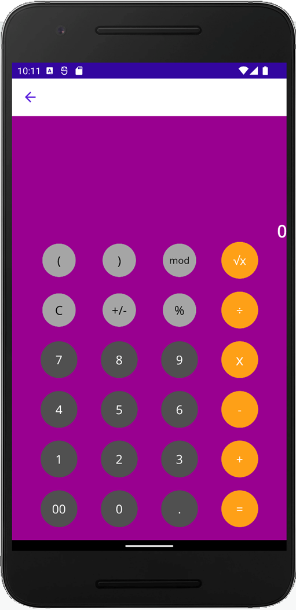

# Calculator Sample App
# Group No: 15

# Team Member-1 : Vaibhav Tapdiya (J776T432)
# Team Member-2 : Snehal Babar(H728E344)
# Team Member-3: Vikas singaram. (Z292U397)

This basic calculator demonstrates using span and spacing features of a Grid layout to achieve a familiar interface.

For more information, see the [Grid documentation](https://docs.microsoft.com/dotnet/maui/user-interface/layouts/grid).

