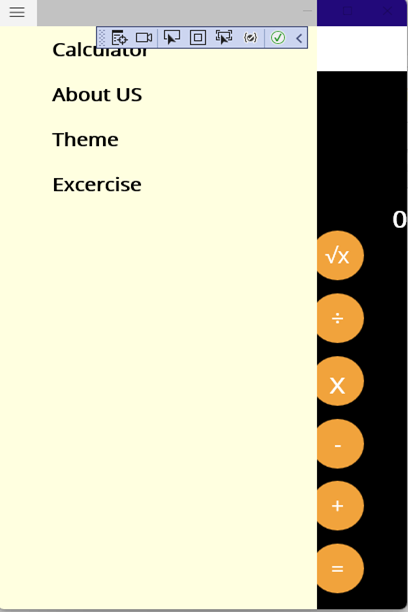

# CrossPlatformMobileDevelopment
Project created for Course CS 797R Cross Platform Mobile Development

# Calculator Question API App
# Group No: 15
# Team Member-1 : Vaibhav Tapdiya (J776T432)
# Team Member-2 : Snehal Babar(H728E344)
# Team Member-3: Vikas singaram. (Z292U397)
    demo video link :https://youtube.com/shorts/F2w_zMdwdxE?feature=share 
  
  <b>Work Resposniblites:</b>
  Vaibhav was responsible for making API and Integrating the API with our calculator app.
  Snehal was responsible for designing excercise page and changing flyout layout to add excercise in menu.
  Vikas was responsible for creating question for excercise questions.
  
  Link to repository : https://github.com/vaibhavtapadiya975/CrossPlatformMobileDevelopment 
 

